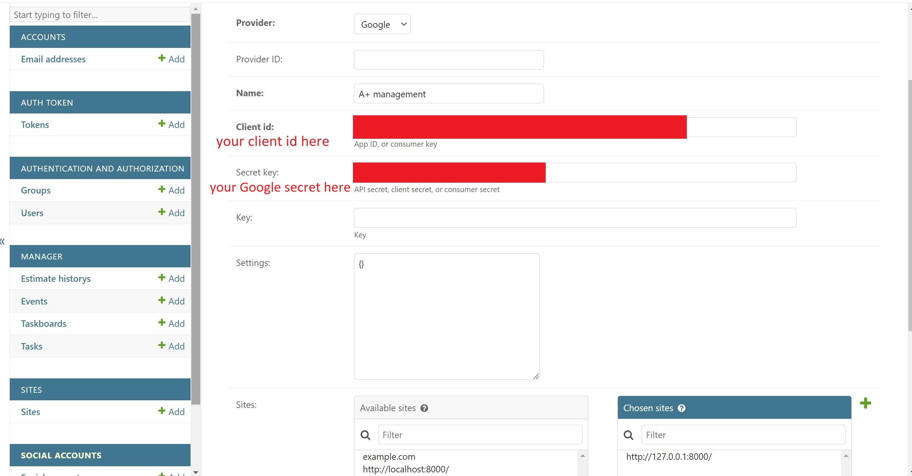

## Setting up Google OAuth 2.0

### Set up your Google credentials
1. Go to [google cloud console](https://console.cloud.google.com/)
2. Login with your desired Google account
    - If you are using a new personally account you will need to link a payment method to the account.
    - If your Google account is associated with an organization you must create your project under that organization.
3. Create a new project
 
 
4. Fill in the form to create the project
 
5. Select the project from the dropdown
 
6. Create a consent screen in API and Services
 
7. Select user type to be external
 
8. Fill out the required fields:
   - App name
   - User support email
   - Developer contact information
   - Don't forget to click save and continue
 
9. Select scopes: email and profile then scroll down and update scope
 
10. Select the credentials tab and click create credentials, select Oauth client
 
11. Select Web application as the application type and fill in the name
 
12. Add `http://localhost:8000` to Authorised JavaScript origins
13. Add `http://localhost:8000` and `http://localhost:8000/api/auth/google-oauth2/callback/` to Authorised redirect URIs and save
 
14. Add `http://localhost:8000/api/auth/google-oauth2/callback/` to .evn as CALLBACK
15. Save the client id and secret and add them to your .env file
    - If you forget your client id and secret click on the app name in credentials to view them again.
 

### Set up the social application on the admin site
1. create a super user
    - run `python manage.py createsuperuser` in a terminal
    - fill out the fields
        - if you're not using windows use your os equivalent of `python`
        - if you're using windows run this command in cmd
2. run the server with `python manage.py runserver`
3. go to `http://localhost:8000/admin`
4. create a new site
    - use `http://localhost:8000/` as both the domain and display name and save
 
5. add a social application. fill out the following fields and save
    - Provider: Google
    - Name: A+ management (or anything you fancy really)
    - Client id: your client id in .env
    - Secret key: your secret in .env
    - Sites: move `http://localhost:8000/` to chosen sites
 
6. find the site id of `http://localhost:8000/`
    - in a terminal run `python manage.py shell`
    - `from django.contrib.sites.models import Site`
    - `sorted([(site.id,site.name) for site in Site.objects.all()])`
7. add the site id of `http://localhost:8000/` to .env as SITE_ID
   - usually the id will be either 3 or 4
